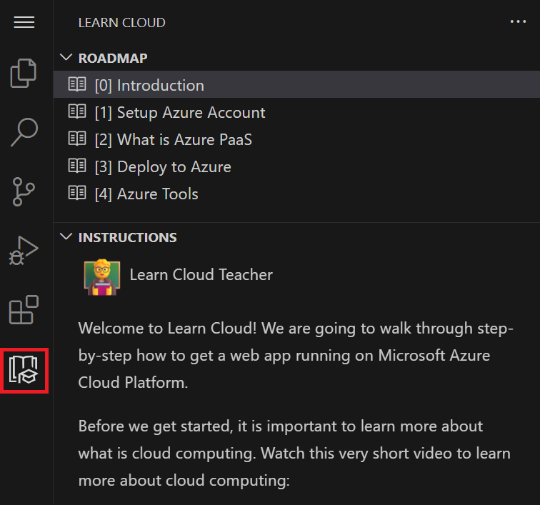

# Learn Cloud

This extension helps you deploy your app to Azure, whether you’re a first-time cloud user or want a closer look at the development cycle. Step-by-step instructions, useful tips, and starter templates get you started using Azure’s Platform as a service (PaaS).

## Features

- Step-by-step walkthrough to deploy to Azure PaaS
- Starter template apps
- Help documentation to answer your questions

## Requirements
- Visual Studio Code 1.50.0 or newer.

## Getting Started

1. Launch Visual Studio Code.
2. Select **Extensions** from the sidebar or press `Ctrl+Shift+X`.
3. Search for “Learn Cloud” and select **Install**.
4. Navigate to the Learn Cloud icon on the sidebar.

## Support for [vscode.dev](https://vscode.dev/)

The Learn Cloud extension supports running on [vscode.dev](https://vscode.dev/) and [github.dev](http://github.dev/). If you’re running terminal commands, you’ll need to run them locally.

## Troubleshooting and Support

Experiencing an issue? Restart VSCode if the extension is not loading. Make sure you’re signed into your Azure account and have an active internet connection. For any other issues, [contact us](vsmarketplace@microsoft.com).

## Contributing

You can contribute to this repo:

* **Ideas, feature requests and bugs**: We are open to all ideas and we want to get rid of bugs! Use the Issues section to either report a new issue, provide your ideas or contribute to existing threads.

### Code of Conduct

This project has adopted the [Microsoft Open Source Code of Conduct](https://opensource.microsoft.com/codeofconduct/). For more information see the [Code of Conduct FAQ](https://opensource.microsoft.com/codeofconduct/faq/) or contact [opencode@microsoft.com](mailto:opencode@microsoft.com) with any additional questions or comments.

<!-- endregion exclude-from-marketplace -->

## Telemetry

VS Code collects usage data and sends it to Microsoft to help improve our products and services. Read our [privacy statement](https://go.microsoft.com/fwlink/?LinkID=528096&clcid=0x409) to learn more. If you don’t wish to send usage data to Microsoft, you can set the `telemetry.enableTelemetry` setting to `false`. Learn more in our [FAQ](https://code.visualstudio.com/docs/supporting/faq#_how-to-disable-telemetry-reporting).

## License

[MIT](LICENSE)